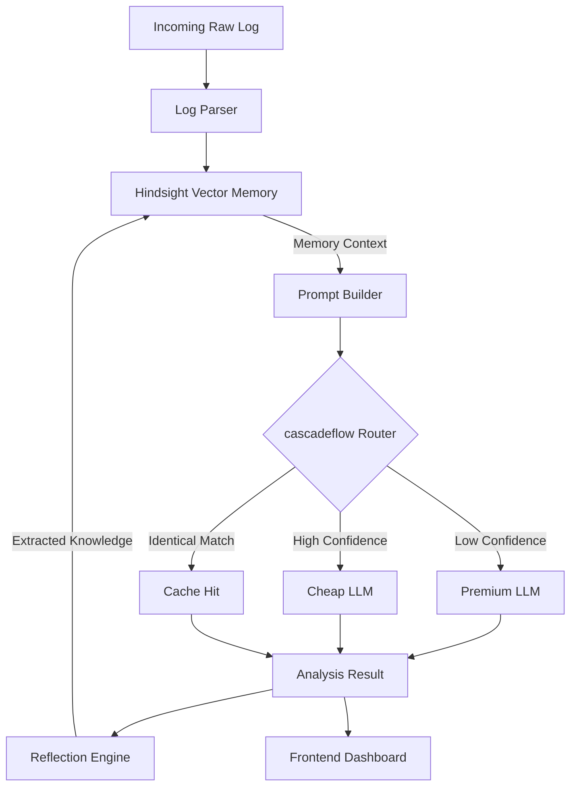

# RecallOps AI


## Project Overview
RecallOps AI is an intelligent incident response platform designed to eliminate tribal knowledge and operational amnesia. It acts as a continuously evolving memory bank for engineering teams, turning raw production incident logs into structured, highly actionable playbooks. By integrating advanced vector-based memory (**Hindsight**) and budget-aware dynamic LLM routing (**cascadeflow**), RecallOps ensures that past incidents are remembered perfectly and resolved efficiently.

## Problem Statement
When modern cloud systems crash, on-call engineers face three major hurdles:
1. **Tribal Knowledge:** The solution to an obscure database timeout often lives only in the head of an engineer who is currently asleep.
2. **Operational Amnesia:** The same incidents occur repeatedly, and engineers waste hours diagnosing issues that were already solved weeks prior.
3. **High AI Costs:** Firing raw logs at premium LLMs (like GPT-4-turbo) for every minor incident leads to exorbitant, unoptimized API bills and slow resolution times.

## Solution
RecallOps AI solves this by introducing a **Reflection Engine** that sits at the center of your incident response pipeline. When an incident occurs:
1. It searches the **Hindsight** memory engine for similar historical incidents.
2. If it's a new issue, the **cascadeflow** runtime routes the prompt to a premium LLM for deep reasoning.
3. If it's a known issue, it routes to a cheaper, faster model—or bypasses the LLM entirely—saving time and money.
4. After resolution, the AI reflects on the quality of the fix and stores an optimized "Memory" back into Hindsight, ensuring the system becomes smarter and cheaper over time.

## Key Features
* 🧠 **Continuous Memory Evolution:** The Reflection Engine grades the quality of AI analysis and updates historical memory documents dynamically.
* 🚦 **Intelligent Model Routing:** Automatically switches between premium and cheap LLM providers based on the confidence of historical memory matches using the **cascadeflow** SDK.
* ⚡ **Cost & Latency Optimization:** Reduces incident resolution times from 5+ seconds to <100ms when identical incidents are encountered.
* 📊 **Executive Dashboard:** A stunning, animated visualization of the AI pipeline, cost savings, and memory quality growth.

## Architecture



## Tech Stack
* **Frontend:** Next.js 14, Tailwind CSS, Framer Motion, Lucide Icons
* **Backend:** Python 3.12, FastAPI, Pydantic
* **AI & Memory:** Hindsight Vector Database, cascadeflow SDK, OpenAI (GPT-4-turbo), Google (Gemini-Flash)

## Folder Structure
```text
incidentmind-ai/
├── backend/            # FastAPI Application & AI Orchestrator
├── frontend/           # Next.js Application & Dashboard UI
├── docs/               # Detailed technical documentation
├── docker/             # Docker configurations
└── docker-compose.yml  # Multi-container orchestration
```

## Screenshots
> Note: Insert actual project screenshots here.
* **Dashboard Overview:** ``
* **Memory Evolution:** ``

## Demo Walkthrough
For a detailed guide on how to present this project to judges or stakeholders, please refer to the [DEMO.md](docs/DEMO.md) guide.

## Installation & Running Locally

### Environment Variables
Create a `.env` file in the root of the project (see `.env.example`):
```env
APP_ENV=development
HINDSIGHT_API_KEY=your_hindsight_api_key
CASCADEFLOW_API_KEY=your_cascadeflow_api_key
OPENROUTER_API_KEY=your_openrouter_key
```

### Option 1: Docker (Recommended)
You can spin up the entire application suite using Docker Compose:
```bash
docker-compose up --build -d
```
* Frontend will be available at: `http://localhost:3000`
* Backend API will be available at: `http://localhost:8000/docs`

### Option 2: Manual Installation
**Backend:**
```bash
cd backend
python -m venv venv
source venv/bin/activate  # or .\venv\Scripts\activate on Windows
pip install -r requirements.txt
uvicorn main:app --reload --port 8000
```

**Frontend:**
```bash
cd frontend
npm install
npm run dev -- -p 3000
```

## AI Pipeline Integrations

### Hindsight Integration
RecallOps uses [Hindsight](https://example.com) to store non-ephemeral vector embeddings of resolved incidents. Unlike standard vector databases, Hindsight is tuned specifically for operational telemetry, allowing the system to surface hyper-relevant historical playbooks instantly.

### cascadeflow Integration
The [cascadeflow](https://example.com) SDK acts as our intelligent runtime. Instead of hardcoding API calls to OpenAI, we pass an array of `ModelConfig` objects. Cascadeflow dynamically routes the request to the cheapest model capable of handling the complexity of the current incident, enforcing budget constraints inherently.

### Reflection Engine
Before saving any incident to Hindsight, our proprietary Reflection Engine evaluates the output based on Specificity, Confidence, Novelty, and Reusability. It assigns a `memory_quality` score (0-100). If an incident is encountered multiple times, the Reflection Engine merges the playbooks and increments the `version`, ensuring the AI gets smarter rather than cluttering the database with duplicates.

## Future Roadmap
* Implement asynchronous reflection using Celery to prevent blocking API responses.
* Add native SSO and RBAC for Enterprise deployments.
* Support direct webhook integrations with PagerDuty and Datadog.
