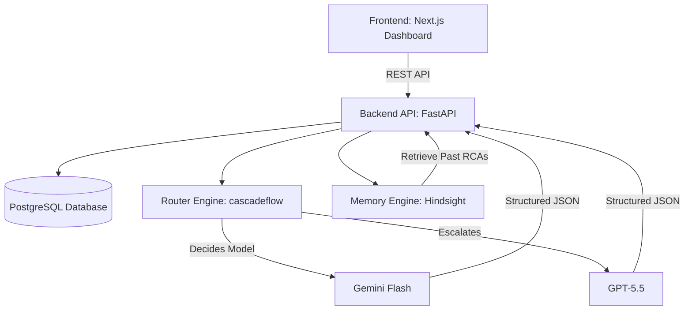
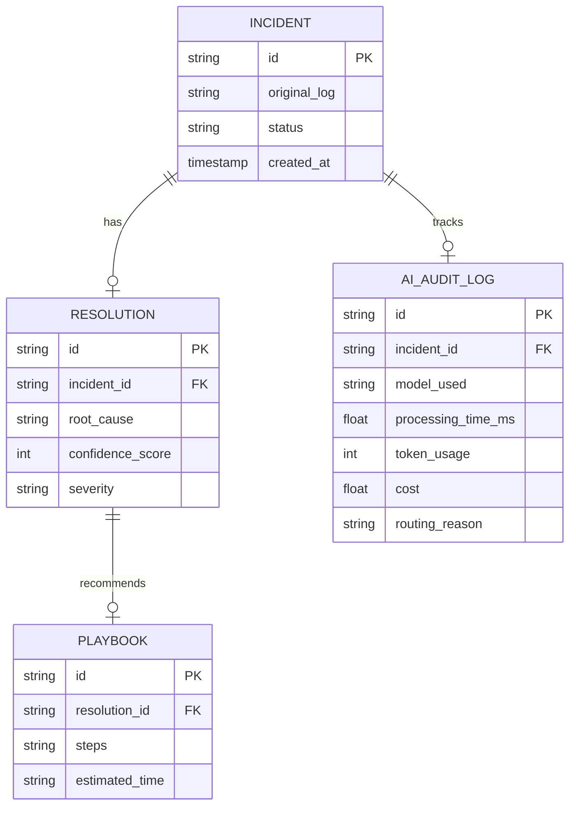

# Software Architecture Document (SAD): IncidentMind AI

## 1. Product Vision & Business Problem
**One Sentence Vision:** An AI-powered incident intelligence platform that remembers every production incident, recommends proven resolutions, and optimizes AI cost through intelligent model routing.

**Business Problem:** DevOps, SRE, and SOC teams spend hours diagnosing repeated or similar incidents. Current AI log analyzers forget past context and waste money on expensive models for simple errors. IncidentMind AI acts as an "organizational memory" that never forgets an outage, automatically routing between AI models (cost optimization) and retrieving past incident resolutions (memory) to slash Mean Time To Resolution (MTTR).

## 2. Functional Requirements
- **Incident Ingestion:** Users can upload logs (.log, .txt, .json) or paste log text.
- **Incident Memory (Hindsight):** The system must store incident details, root cause analyses (RCAs), and engineer notes, retrieving similar past incidents for new queries.
- **Intelligent Routing (cascadeflow):** The system must route queries to cheaper models (Gemini Flash) for simple/confident incidents and escalate to advanced models (GPT-5.5) for complex/critical ones.
- **Structured AI Output:** AI must return structured JSON containing: severity, root cause, confidence score, recommended playbook, related past incidents, model used, latency, and token usage.
- **Dashboard & Analytics:** Display total incidents, average resolution time, AI accuracy, memory hit rate, average cost, model usage breakdown, and top root causes.

## 3. Non-Functional Requirements
- **Performance & Latency:** The system should resolve standard incidents using Gemini Flash in <2 seconds.
- **Cost Efficiency:** AI processing costs should be minimized using cascadeflow's budget enforcement and fallback routing.
- **Maintainability:** Separation of concerns across 7 core modules (Frontend, API, Memory, Router, AI, Analytics, Database).

## 4. System Architecture
The system consists of independent modules communicating via the FastAPI backend:



### Module Breakdown:
1. **Frontend:** Next.js, Tailwind CSS, shadcn/ui. Strictly for display.
2. **Backend API:** FastAPI. The traffic controller.
3. **Memory Engine:** Hindsight. Stores and retrieves incident context, past RCAs, and engineer notes.
4. **Router Engine:** cascadeflow. Handles model routing, confidence escalation, and audit trails.
5. **AI Engine:** Prompt management and structured output parsing.
6. **Analytics Engine:** Aggregates DB metrics for the dashboard.
7. **Database:** PostgreSQL for structured relational data (Incident history, analytics, metadata).

## 5. Memory Lifecycle (Hindsight)
1. **Ingest:** A new incident is resolved (either automatically or with engineer input).
2. **Retain:** The RCA, playbook, and root cause are stored in Hindsight memory.
3. **Recall:** When a new log is uploaded, the backend queries Hindsight for the top 3 similar past incidents.
4. **Reflect:** The AI uses the retrieved past incidents to inform its current RCA, outputting specific references (e.g., "This matches Incident #42").

## 6. cascadeflow Routing Rules
1. **Budget Enforcement:** Ensure daily token budgets are maintained.
2. **Complexity Routing:**
   - *Simple Log* ➔ **Gemini Flash** (Fast, cheap).
   - *Medium Complexity / Low Confidence from Gemini* ➔ **GPT-4.1 Mini**.
   - *Critical Production Failure* ➔ **GPT-5.5** (Always prioritize accuracy).
3. **Audit Trail:** Every decision (Model chosen, confidence, latency, cost) is logged to PostgreSQL for dashboard visibility.

## 7. Database Schema (PostgreSQL)



## 8. API Contracts

### `POST /api/v1/incidents/analyze`
**Request:**
```json
{
  "log_content": "503 Service Unavailable Pod CrashLoopBackOff",
  "source": "kubernetes"
}
```
**Response:**
```json
{
  "incident_id": "inc_12345",
  "severity": "High",
  "root_cause": "Memory Limit Exceeded",
  "confidence": 94,
  "playbook": ["kubectl describe pod", "Increase memory limit", "Restart deployment"],
  "related_incidents": ["inc_42"],
  "audit": {
    "model_used": "Gemini Flash",
    "latency_ms": 1300,
    "cost": 0.007,
    "routing_reason": "Simple Log, high confidence"
  }
}
```

### `GET /api/v1/analytics/dashboard`
Returns aggregated stats: Total incidents, average MTTR, memory hit rate, total cost saved, etc.

## 9. Folder Structure
```text
incident-intelligence-platform/
├── frontend/             # Next.js app
│   ├── app/
│   ├── components/
│   └── lib/
├── backend/              # FastAPI app
│   ├── api/              # Route handlers
│   ├── services/         # Business logic
│   ├── memory/           # Hindsight integration
│   ├── router/           # cascadeflow integration
│   ├── llm/              # Prompts and LLM parsing
│   ├── database/         # SQLAlchemy models and migrations
│   └── analytics/        # Dashboard aggregation logic
├── docs/                 # Architecture & API docs
├── tests/
└── docker-compose.yml
```

## 10. Technology Decisions
- **Frontend:** Next.js + Tailwind + shadcn/ui for rapid, beautiful UI development.
- **Backend:** FastAPI for high-performance Python async endpoints (ideal for AI/LLM wrapping).
- **Database:** PostgreSQL (Supabase/Neon) for reliable relational data storage.
- **Memory:** **Hindsight** (Mandatory for Hackathon).
- **Runtime Intelligence:** **cascadeflow** (Mandatory for Hackathon).
- **LLM Provider:** OpenRouter (access to Gemini Flash, GPT-4o-mini, GPT-4o, Claude).

## 11. Development Roadmap (Phases)
- **Phase 1: Architecture & Setup (Current)** - Finalize SAD, setup repo, Docker, and DB schemas.
- **Phase 2: Memory & Database (Backend)** - Implement PostgreSQL models and Hindsight Retain/Recall logic.
- **Phase 3: Router & LLM (Backend)** - Implement cascadeflow routing, define prompts, and enforce JSON outputs.
- **Phase 4: API Gateway (Backend)** - Connect routes to Memory and Router modules.
- **Phase 5: Frontend Dashboard & Upload** - Build Next.js UI, connect to FastAPI.
- **Phase 6: Polish & Demo Prep** - Inject realistic incident logs, simulate the learning curve, and record the demo video.

## 12. User Review Required
> [!IMPORTANT]
> Please review this Software Architecture Document. 
> 
> Specifically, confirm if the **Memory Lifecycle (Hindsight)** and **Routing Rules (cascadeflow)** align with how you want to present the demo story for the judges. If this looks good, we can proceed to creating the workspace folder structure and scaffolding the applications (Phase 1 execution).
