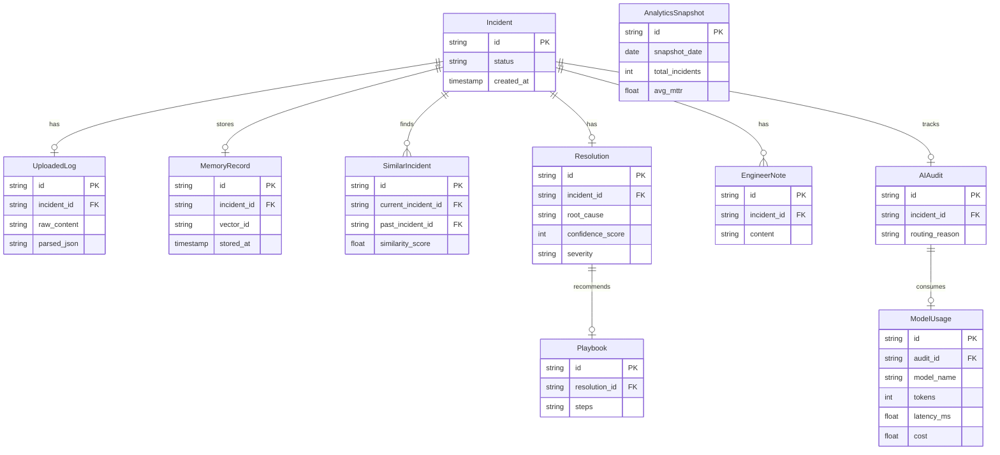
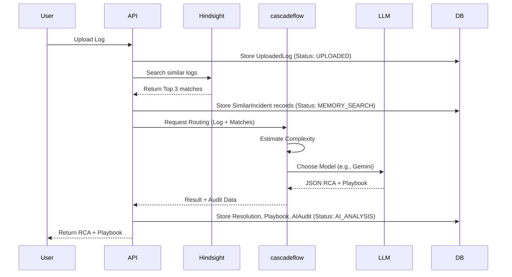
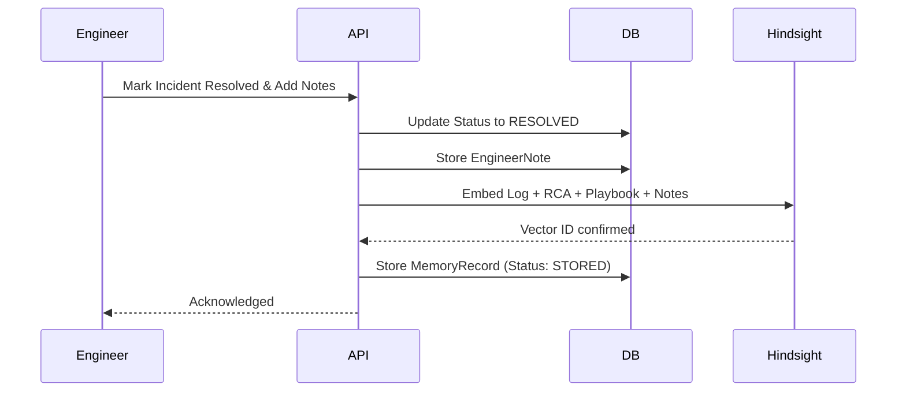
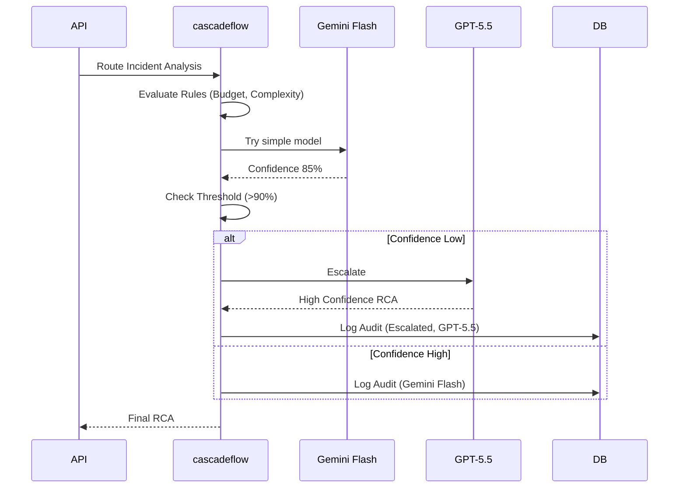

# Software Architecture Document (SAD): IncidentMind AI

## 1. Components
1. **Frontend:** Next.js, Tailwind CSS, shadcn/ui.
2. **Backend API:** FastAPI.
3. **Memory Engine:** Hindsight integration layer.
4. **Router Engine:** cascadeflow integration layer.
5. **AI Engine:** Prompt management and LLM parsing.
6. **Analytics Engine:** Aggregates DB metrics.
7. **Database:** PostgreSQL.

## 2. Folder Structure
```text
incident-intelligence/
├── frontend/
│   ├── app/
│   ├── components/
│   └── lib/
├── backend/
│   ├── api/
│   ├── services/
│   ├── memory/
│   ├── router/
│   ├── llm/
│   ├── database/
│   └── analytics/
├── prompts/
│   ├── incident_analysis.md
│   ├── memory_retrieval.md
│   ├── playbook_generation.md
│   ├── severity_detection.md
│   ├── routing.md
│   └── summary.md
├── docs/
└── tests/
```

## 3. Database Schema (PostgreSQL)
Expanded for flexibility and cleaner relationships.



## 4. API Design (Contracts)
Around 12-15 focused endpoints.

- **Incident Management**
  - `POST /api/v1/incident/upload` - Upload log file/text.
  - `POST /api/v1/incident/analyze` - Trigger AI analysis pipeline.
  - `GET /api/v1/incident/{id}` - Get full incident details.
  - `GET /api/v1/incident/history` - List past incidents (paginated).
  - `GET /api/v1/incident/{id}/similar` - Get similar incidents from DB.
  - `PATCH /api/v1/incident/{id}/status` - Update state machine status.

- **Memory (Hindsight)**
  - `POST /api/v1/memory/store` - Manually trigger storing an RCA to memory.
  - `GET /api/v1/memory/search` - Direct semantic search endpoint.

- **Playbook & Feedback**
  - `GET /api/v1/playbook/{id}` - Get playbook steps.
  - `POST /api/v1/feedback` - Engineer notes/feedback on AI accuracy.

- **Analytics**
  - `GET /api/v1/analytics/dashboard` - High-level metrics.
  - `GET /api/v1/analytics/cost` - Cost aggregation.
  - `GET /api/v1/analytics/models` - Model usage breakdown.

## 5. Sequence Diagrams

### 5.1 Incident Analysis Flow


### 5.2 Memory Learning Flow


### 5.3 cascadeflow Routing Flow


## 6. Deployment
- **Frontend:** Vercel (Next.js).
- **Backend:** Render or Railway (FastAPI).
- **Database:** Supabase (PostgreSQL).
- **Memory:** Hindsight Cloud.
